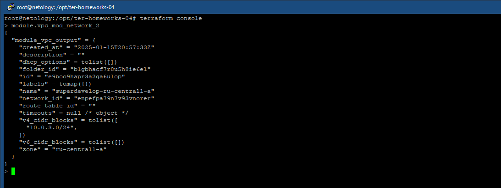

# ter-homeworks-04

## Задание 1

cloud-init.yml:

``` terraform
#cloud-config
users:
  - default
  - name: ${username}
    sudo: ["ALL=(ALL) NOPASSWD:ALL"]
    groups: sudo
    shell: /bin/bash
    ssh_authorized_keys:
      - ${ssh_public_key}

package_update: true
package_upgrade: false
packages:
  - vim
  - nginx
```

ВМ с метками:


Инстансы:


<table>
  <tr>
    <td>develop-webs-0</td>
    <td></td>
  </tr>
  <tr>
    <td>develop-webs-1</td>
    <td></td>
  </tr>
  <tr>
    <td>stage-web-stage-0</td>
    <td></td>
  </tr>
</table>

terraform console:


## Задание 2

terraform console:



"Переезд" сетей:

``` terraform
#resource "yandex_vpc_network" "develop" {
#  name = var.vpc_name
#}

#resource "yandex_vpc_subnet" "develop_a" {
#  name           = var.vpc_subnet_a_name
#  zone           = var.vpc_subnet_a_zone
#  network_id     = yandex_vpc_network.develop.id
#  v4_cidr_blocks = var.vpc_subnet_a_cidr
#}

#resource "yandex_vpc_subnet" "develop_b" {
#  name           = var.vpc_subnet_b_name
#  zone           = var.vpc_subnet_b_zone
#  network_id     = yandex_vpc_network.develop.id
#  v4_cidr_blocks = var.vpc_subnet_b_cidr
#}

#                  __
#                 |  |
#                 |  |
#                 |  |
#              ___|  |___
#              \        /
#               \      /
#                \    /
#                 \  /
#                  \/

module "develop_a" {
  source       = "./vpc"
  mod_vpc_name = var.vpc_subnet_a_name
  mod_vpc_subnet_zone = var.vpc_subnet_a_zone
  mod_vpc_subnet_cidr = var.vpc_subnet_a_cidr
}

module "develop_b" {
  source       = "./vpc"
  mod_vpc_name = var.vpc_subnet_b_name
  mod_vpc_subnet_zone = var.vpc_subnet_b_zone
  mod_vpc_subnet_cidr = var.vpc_subnet_b_cidr
}
```

Возврат id сети и подсети из модуля:

``` terraform
output "network_id" {
   value = yandex_vpc_network.mod_vpc.id
}

output "subnet_id" {
   value = yandex_vpc_subnet.mod_vpc_subnet.id
}
```

Привязка к сети, объявленной через модуль:

``` terraform
# Инициализация модулей (инстансов)
module "test-vm" {
  source         = "git::https://github.com/udjin10/yandex_compute_instance.git?ref=main"
  env_name       = var.module_1_env_name
#  network_id     = yandex_vpc_network.develop.id
  network_id     = module.develop_a.network_id
  subnet_zones   = [var.vpc_subnet_a_zone,var.vpc_subnet_b_zone]
#  subnet_ids     = [yandex_vpc_subnet.develop_a.id,yandex_vpc_subnet.develop_b.id]
  subnet_ids     = [module.develop_a.subnet_id,module.develop_b.subnet_id]
  instance_name  = var.module_1_instance_name
  instance_count = var.module_1_instance_count
  image_family   = var.module_1_image_family
  public_ip      = var.module_1_public_ip
  labels = {
    label = var.module_1_label
  }
  metadata = {
    user-data          = data.template_file.cloudinit.rendered
    serial-port-enable = var.module_1_serial-port
  }
}
```

``` bash
terraform-docs markdown table --output-file ./docs/terraform-docs.md .
```

[terraform-docs](./docs/terraform-docs.md)
