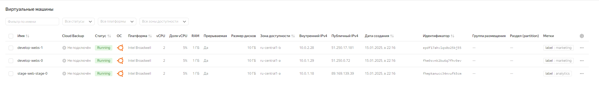
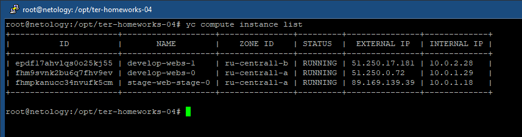
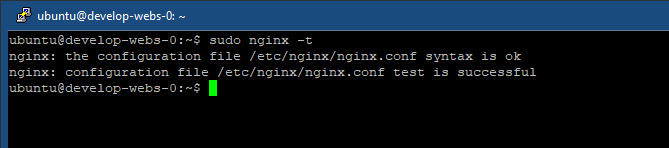
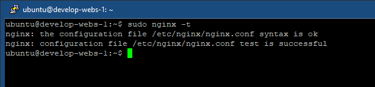
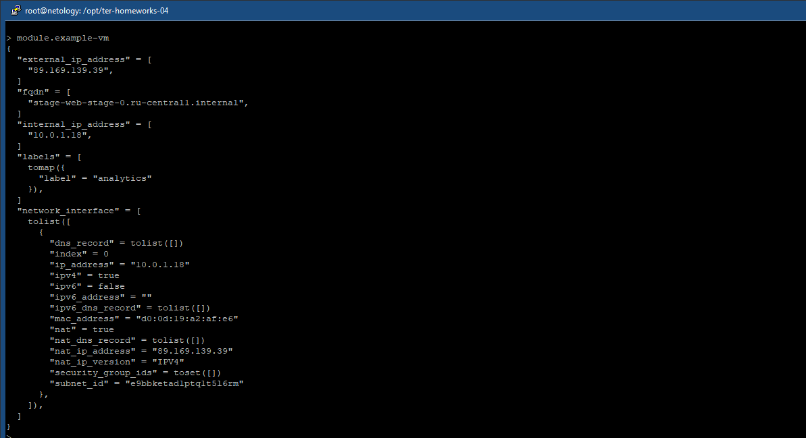

# ter-homeworks-04

## Задание 1

cloud-init.yml:

``` terraform
#cloud-config
users:
  - default
  - name: ${username}
    sudo: ["ALL=(ALL) NOPASSWD:ALL"]
    groups: sudo
    shell: /bin/bash
    ssh_authorized_keys:
      - ${ssh_public_key}

package_update: true
package_upgrade: false
packages:
  - vim
  - nginx
```

ВМ с метками:



Инстансы:



<table>
  <tr>
    <td>develop-webs-0</td>
    <td></td>
  </tr>
  <tr>
    <td>develop-webs-1</td>
    <td></td>
  </tr>
  <tr>
    <td>stage-web-stage-0</td>
    <td></td>
  </tr>
</table>

terraform console:




