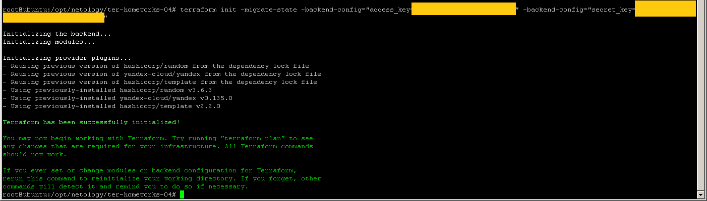
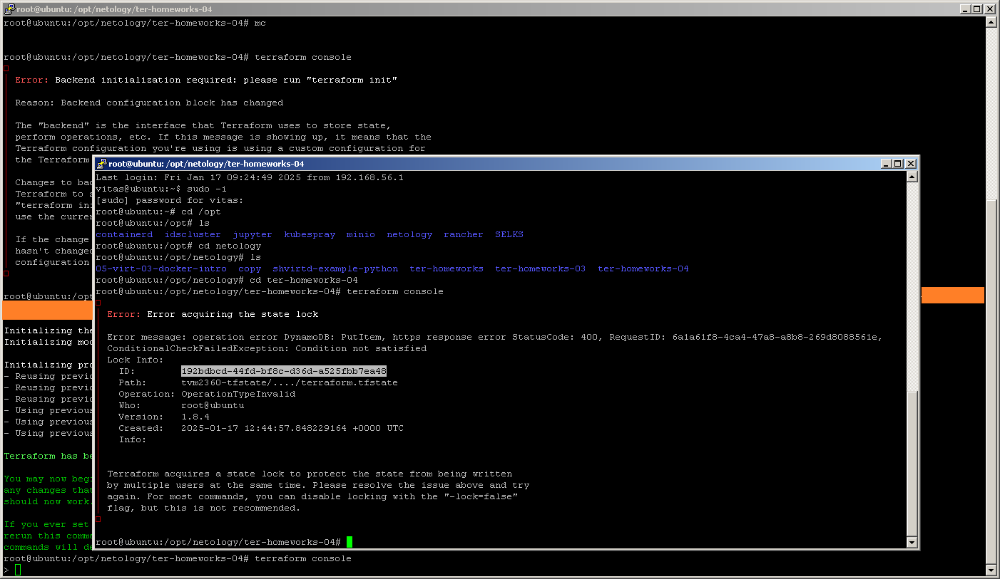

# ter-homeworks-05

## Задание 1

``` bash
tflint > docs/tflint.log
```

tflint.log:

```
7 issue(s) found:

Warning: Module source "git::https://github.com/udjin10/yandex_compute_instance.git?ref=main" uses a default branch as ref (main) (terraform_module_pinned_source)

  on main.tf line 40:
  40:   source         = "git::https://github.com/udjin10/yandex_compute_instance.git?ref=main"

Reference: https://github.com/terraform-linters/tflint-ruleset-terraform/blob/v0.10.0/docs/rules/terraform_module_pinned_source.md

Warning: Module source "git::https://github.com/udjin10/yandex_compute_instance.git?ref=main" uses a default branch as ref (main) (terraform_module_pinned_source)

  on main.tf line 65:
  65:   source         = "git::https://github.com/udjin10/yandex_compute_instance.git?ref=main"

Reference: https://github.com/terraform-linters/tflint-ruleset-terraform/blob/v0.10.0/docs/rules/terraform_module_pinned_source.md

Warning: Missing version constraint for provider "template" in `required_providers` (terraform_required_providers)

  on main.tf line 113:
 113: data "template_file" "cloudinit" {

Reference: https://github.com/terraform-linters/tflint-ruleset-terraform/blob/v0.10.0/docs/rules/terraform_required_providers.md

Warning: Missing version constraint for provider "yandex" in `required_providers` (terraform_required_providers)

  on providers.tf line 4:
   4:     yandex = {
   5:       source = "yandex-cloud/yandex"
   6:     }

Reference: https://github.com/terraform-linters/tflint-ruleset-terraform/blob/v0.10.0/docs/rules/terraform_required_providers.md

Warning: [Fixable] variable "vpc_name" is declared but not used (terraform_unused_declarations)

  on variables.tf line 19:
  19: variable "vpc_name" {

Reference: https://github.com/terraform-linters/tflint-ruleset-terraform/blob/v0.10.0/docs/rules/terraform_unused_declarations.md

Warning: [Fixable] variable "vpc_subnet_mysql_name" is declared but not used (terraform_unused_declarations)

  on variables.tf line 31:
  31: variable "vpc_subnet_mysql_name" {

Reference: https://github.com/terraform-linters/tflint-ruleset-terraform/blob/v0.10.0/docs/rules/terraform_unused_declarations.md

Warning: [Fixable] variable "vpc_subnet_mysql_zone_with_cidr" is declared but not used (terraform_unused_declarations)

  on variables.tf line 67:
  67: variable "vpc_subnet_mysql_zone_with_cidr" {

Reference: https://github.com/terraform-linters/tflint-ruleset-terraform/blob/v0.10.0/docs/rules/terraform_unused_declarations.md
```

Описание сообщений:

1. Модуль с источноком "git::https://github.com/udjin10/yandex_compute_instance.git?ref=main" ссылается на ветку main (по умолчанию). Это обстоятельство может привести к непредсказуемым последствиям при переключении между ветками.

2. Для провайдеров template, yandex отсутствует констрейнт, определяющий версии. Это обстоятельство может привести к непредсказуемым последствиям при переключении между ветками.

3. Переменные vpc_name, vpc_subnet_mysql_name, vpc_subnet_mysql_zone_with_cidr объявлены, но не используются

``` bash
docker pull bridgecrew/checkov
docker run --tty --rm --volume /opt/netology/ter-homeworks-05:/tf --workdir /tf bridgecrew/checkov --directory /tf > /opt/netology/ter-homeworks-05/docs/checkov.log
```

checkov.log:

```
terraform scan results:

Passed checks: 3, Failed checks: 4, Skipped checks: 0

Check: CKV_YC_12: "Ensure public IP is not assigned to database cluster."
        PASSED for resource: module.mysql-develop.yandex_mdb_mysql_cluster.my-mysql
        File: /mysql/main.tf:11-32
        Calling File: /main.tf:89-97
Check: CKV_YC_1: "Ensure security group is assigned to database cluster."
        PASSED for resource: module.mysql-develop.yandex_mdb_mysql_cluster.my-mysql
        File: /mysql/main.tf:11-32
        Calling File: /main.tf:89-97
Check: CKV_YC_19: "Ensure security group does not contain allow-all rules."
        PASSED for resource: module.mysql-develop.yandex_vpc_security_group.mysql-sg
        File: /mysql/main.tf:36-46
        Calling File: /main.tf:89-97
Check: CKV_TF_1: "Ensure Terraform module sources use a commit hash"
        FAILED for resource: test-vm
        File: /main.tf:39-62

                39 | module "test-vm" {
                40 |   source         = "git::https://github.com/udjin10/yandex_compute_instance.git?ref=main"
                41 |   env_name       = var.module_1_env_name
                42 | #  network_id     = yandex_vpc_network.develop.id
                43 |   network_id     = module.develop_a.network_id
                44 | #  subnet_zones   = [var.vpc_subnet_a_zone,var.vpc_subnet_b_zone]
                45 |   subnet_zones   = module.develop_a.subnet_zones
                46 | #  subnet_ids     = [yandex_vpc_subnet.develop_a.id,yandex_vpc_subnet.develop_b.id]
                47 | #  subnet_ids     = [module.develop_a.subnet_id,module.develop_b.subnet_id]
                48 |   subnet_ids     = module.develop_a.subnet_id
                49 |
                50 |
                51 |   instance_name  = var.module_1_instance_name
                52 |   instance_count = var.module_1_instance_count
                53 |   image_family   = var.module_1_image_family
                54 |   public_ip      = var.module_1_public_ip
                55 |   labels = {
                56 |     label = var.module_1_label
                57 |   }
                58 |   metadata = {
                59 |     user-data          = data.template_file.cloudinit.rendered
                60 |     serial-port-enable = var.module_1_serial-port
                61 |   }
                62 | }

Check: CKV_TF_2: "Ensure Terraform module sources use a tag with a version number"
        FAILED for resource: test-vm
        File: /main.tf:39-62

                39 | module "test-vm" {
                40 |   source         = "git::https://github.com/udjin10/yandex_compute_instance.git?ref=main"
                41 |   env_name       = var.module_1_env_name
                42 | #  network_id     = yandex_vpc_network.develop.id
                43 |   network_id     = module.develop_a.network_id
                44 | #  subnet_zones   = [var.vpc_subnet_a_zone,var.vpc_subnet_b_zone]
                45 |   subnet_zones   = module.develop_a.subnet_zones
                46 | #  subnet_ids     = [yandex_vpc_subnet.develop_a.id,yandex_vpc_subnet.develop_b.id]
                47 | #  subnet_ids     = [module.develop_a.subnet_id,module.develop_b.subnet_id]
                48 |   subnet_ids     = module.develop_a.subnet_id
                49 |
                50 |
                51 |   instance_name  = var.module_1_instance_name
                52 |   instance_count = var.module_1_instance_count
                53 |   image_family   = var.module_1_image_family
                54 |   public_ip      = var.module_1_public_ip
                55 |   labels = {
                56 |     label = var.module_1_label
                57 |   }
                58 |   metadata = {
                59 |     user-data          = data.template_file.cloudinit.rendered
                60 |     serial-port-enable = var.module_1_serial-port
                61 |   }
                62 | }

Check: CKV_TF_1: "Ensure Terraform module sources use a commit hash"
        FAILED for resource: example-vm
        File: /main.tf:64-87

                64 | module "example-vm" {
                65 |   source         = "git::https://github.com/udjin10/yandex_compute_instance.git?ref=main"
                66 |   env_name       = var.module_2_env_name
                67 | #  network_id     = yandex_vpc_network.develop.id
                68 |   network_id     = module.develop_b.network_id
                69 | #  subnet_zones   = [var.vpc_subnet_a_zone]
                70 |   subnet_zones   = module.develop_b.subnet_zones
                71 | #  subnet_ids     = [yandex_vpc_subnet.develop_a.id]
                72 | #  subnet_ids     = [module.develop_a.subnet_id]
                73 |   subnet_ids     = module.develop_b.subnet_id
                74 |
                75 |
                76 |   instance_name  = var.module_2_instance_name
                77 |   instance_count = var.module_2_instance_count
                78 |   image_family   = var.module_2_image_family
                79 |   public_ip      = var.module_2_public_ip
                80 |   labels = {
                81 |     label = var.module_2_label
                82 |   }
                83 |   metadata = {
                84 |     user-data          = data.template_file.cloudinit.rendered
                85 |     serial-port-enable = var.module_2_serial-port
                86 |   }
                87 | }

Check: CKV_TF_2: "Ensure Terraform module sources use a tag with a version number"
        FAILED for resource: example-vm
        File: /main.tf:64-87

                64 | module "example-vm" {
                65 |   source         = "git::https://github.com/udjin10/yandex_compute_instance.git?ref=main"
                66 |   env_name       = var.module_2_env_name
                67 | #  network_id     = yandex_vpc_network.develop.id
                68 |   network_id     = module.develop_b.network_id
                69 | #  subnet_zones   = [var.vpc_subnet_a_zone]
                70 |   subnet_zones   = module.develop_b.subnet_zones
                71 | #  subnet_ids     = [yandex_vpc_subnet.develop_a.id]
                72 | #  subnet_ids     = [module.develop_a.subnet_id]
                73 |   subnet_ids     = module.develop_b.subnet_id
                74 |
                75 |
                76 |   instance_name  = var.module_2_instance_name
                77 |   instance_count = var.module_2_instance_count
                78 |   image_family   = var.module_2_image_family
                79 |   public_ip      = var.module_2_public_ip
                80 |   labels = {
                81 |     label = var.module_2_label
                82 |   }
                83 |   metadata = {
                84 |     user-data          = data.template_file.cloudinit.rendered
                85 |     serial-port-enable = var.module_2_serial-port
                86 |   }
                87 | }

terraform_plan scan results:

Passed checks: 6, Failed checks: 6, Skipped checks: 0

Check: CKV_YC_4: "Ensure compute instance does not have serial console enabled."
        PASSED for resource: module.example-vm.yandex_compute_instance.vm[0]
        File: /tf.json:0-0
Check: CKV_YC_12: "Ensure public IP is not assigned to database cluster."
        PASSED for resource: module.mysql-develop.yandex_mdb_mysql_cluster.my-mysql
        File: /tf.json:0-0
Check: CKV_YC_1: "Ensure security group is assigned to database cluster."
        PASSED for resource: module.mysql-develop.yandex_mdb_mysql_cluster.my-mysql
        File: /tf.json:0-0
Check: CKV_YC_19: "Ensure security group does not contain allow-all rules."
        PASSED for resource: module.mysql-develop.yandex_vpc_security_group.mysql-sg
        File: /tf.json:0-0
Check: CKV_YC_4: "Ensure compute instance does not have serial console enabled."
        PASSED for resource: module.test-vm.yandex_compute_instance.vm[0]
        File: /tf.json:0-0
Check: CKV_YC_4: "Ensure compute instance does not have serial console enabled."
        PASSED for resource: module.test-vm.yandex_compute_instance.vm[1]
        File: /tf.json:0-0
Check: CKV_YC_2: "Ensure compute instance does not have public IP."
        FAILED for resource: module.example-vm.yandex_compute_instance.vm[0]
        File: /tf.json:0-0
Check: CKV_YC_11: "Ensure security group is assigned to network interface."
        FAILED for resource: module.example-vm.yandex_compute_instance.vm[0]
        File: /tf.json:0-0
Check: CKV_YC_2: "Ensure compute instance does not have public IP."
        FAILED for resource: module.test-vm.yandex_compute_instance.vm[0]
        File: /tf.json:0-0
Check: CKV_YC_11: "Ensure security group is assigned to network interface."
        FAILED for resource: module.test-vm.yandex_compute_instance.vm[0]
        File: /tf.json:0-0
Check: CKV_YC_2: "Ensure compute instance does not have public IP."
        FAILED for resource: module.test-vm.yandex_compute_instance.vm[1]
        File: /tf.json:0-0
Check: CKV_YC_11: "Ensure security group is assigned to network interface."
        FAILED for resource: module.test-vm.yandex_compute_instance.vm[1]
        File: /tf.json:0-0
```

Описание сообщений:

Контроль *.tf Пройдено: 3, Ошибок: 4, Пропущено: 0

Пройдены:

1. СУБД не назначать (ограничивать) публичные IP
2. В группах безопасности не использовать общие правила типа "allow-all"

Ошибки:

1. При определении источников модулей использовать хеш для сверки
2. При использовании модулей использовать и контролировать версии

Контроль плана. Пройдено: 6, Ошибок: 6, Пропущено: 0

Пройдены:

1. СУБД не назначать (ограничивать) публичные IP
2. В группах безопасности не использовать общие правила типа "allow-all"
3. В инстансах не использовать последовательные консольные порты

Ошибки:

1. Инстансам не назначать (ограничивать) публичные IP
2. Группам безопасности не назначать сетевые интерфейсы

## Задание 2







## Задание 3

TFLint

Было: 

Стало: 

Checkov

Было: 

Стало: 

Изменения:

1. В модуле ref поменял на dev

2. Для провайдеров template, yandex добавлен констрейнт и определена версия.

3. Отменено объявление и присвоение для Переменных 

4. Запрет на выдачу инстансам публичных IP

Изменение плана (после апргрейда провайдеров):


Merge PR (https://github.com/tvm2360/ter-homeworks-04/commit/ae801659f1834aa73a87f6e87f19624dd8f34519)


